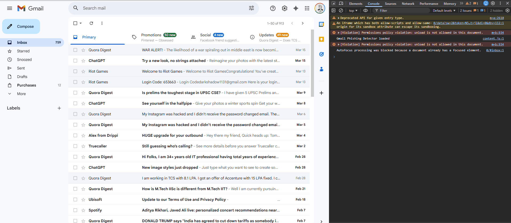
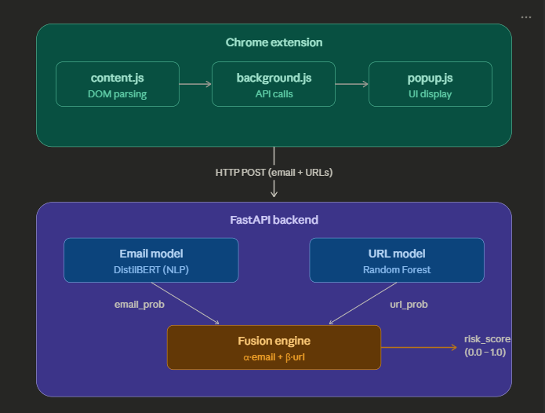

# 📧 Gmail Phishing Detector Extension

A real-time phishing detection system that scans Gmail emails using **dual ML models** — NLP-based email analysis (DistilBERT) and URL threat detection (Random Forest) — fused into a single risk score, delivered through an inline Chrome extension warning banner.

> **Why this exists:** 91% of cyberattacks begin with a phishing email. Existing spam filters miss sophisticated phishing attempts that mimic legitimate services. This extension adds a second layer of real-time protection by analyzing both email content and embedded URLs before you click.





<div align ="center">
## 🏗️ Architecture


</div>


## ✨ Key Features

- **Dual-model fusion** — Combines NLP-based email body analysis with URL threat detection into a single weighted risk score, reducing false positives compared to either model alone
- **Real-time Gmail integration** — Uses `MutationObserver` to detect when emails are opened and triggers analysis instantly, without page reloads
- **Inline warning banners** — Injects "⚠️ High Risk" or "⚠️ Suspicious" banners directly into Gmail's UI
- **FastAPI inference backend** — Async API serving both models concurrently with low-latency responses
- **Probability fusion logic** — Intelligent weighting that considers confidence from both models before flagging

---

## 🧠 ML Models

### 1. Email Phishing Model (NLP)

| | |
|---|---|
| **Architecture** | DistilBERT (fine-tuned) |
| **Task** | Binary classification — phishing vs. legitimate |
| **Input** | Raw email text (subject + body) |
| **Output** | Phishing probability (0.0 – 1.0) |
| **Framework** | HuggingFace Transformers, PyTorch |

### 2. URL Phishing Model

| | |
|---|---|
| **Architecture** | Random Forest pipeline |
| **Task** | Binary classification — malicious vs. safe URL |
| **Features** | URL length, hostname length, special char count, IP presence, domain heuristics, HTTPS check |
| **Output** | URL phishing probability (0.0 – 1.0) |
| **Framework** | Scikit-learn |

### Fusion Strategy

```
final_risk = α × P(phishing|email) + β × max(P(phishing|url_i))
```

Weights `α` and `β` are tuned to minimize false positives while maintaining high recall on known phishing patterns. If no URLs are present, the system falls back to the email-only score.

---

## 📁 Project Structure

```
Gmail-Phishing-Detector-Extension-/
│
├── Models/                        # ML model training & saved artifacts
│   ├── email_model/               #   DistilBERT fine-tuning scripts
│   └── url_model/                 #   Random Forest training pipeline
│
├── Phishing_extension/            # Chrome extension source code
│   ├── manifest.json              #   Extension config (Manifest V3)
│   ├── content.js                 #   Gmail DOM parser + MutationObserver
│   ├── background.js              #   Service worker — API communication
│   └── popup.html / popup.js      #   Extension popup UI
│
├── .github/workflows/             # CI/CD pipeline (GitHub Actions)
├── .gitignore
├── requirements.txt
└── README.md
```

---

## 🛠️ Tech Stack

| Layer | Technologies |
|---|---|
| **ML / NLP** | Python · PyTorch · HuggingFace Transformers · Scikit-learn |
| **Backend** | FastAPI · Uvicorn |
| **Extension** | JavaScript · Chrome Extensions API (Manifest V3) · MutationObserver |
| **Data** | Pandas · NumPy |
| **DevOps** | GitHub Actions · Git LFS |

---

## 🚀 Getting Started

### Prerequisites

- Python 3.9+
- Google Chrome
- Git

### 1. Clone the repo

```bash
git clone https://github.com/Aditya-G-22/Gmail-Phishing-Detector-Extension-.git
cd Gmail-Phishing-Detector-Extension-
```

### 2. Start the backend

```bash
python -m venv venv
source venv/bin/activate        # Windows: venv\Scripts\activate
pip install -r requirements.txt
uvicorn main:app --reload --port 8000
```

The API will be available at `http://localhost:8000`. You can test it at `http://localhost:8000/docs` (Swagger UI).

### 3. Load the Chrome extension

1. Open `chrome://extensions/` in Chrome
2. Enable **Developer mode** (top-right toggle)
3. Click **Load unpacked** → select the `Phishing_extension/` folder
4. Open Gmail — the extension monitors emails automatically

---

## 🧪 Tested Against

| Email Source | Type | Result |
|---|---|---|
| Quora | Legitimate | ✅ Correctly passed |
| Discord | Legitimate | ✅ Correctly passed |
| Spotify | Legitimate | ✅ Correctly passed |
| Google | Legitimate | ✅ Correctly passed |
| Simulated phishing | Malicious | 🚨 Correctly flagged |

---

## 🗺️ Roadmap

- [ ] Link hover previews showing per-URL risk scores
- [ ] Extend support to Outlook Web and Yahoo Mail
- [ ] User feedback loop to retrain and improve models
- [ ] Publish to Chrome Web Store
- [ ] Sender reputation scoring (SPF/DKIM checks)
- [ ] Analytics dashboard for phishing attempt history

---

## 📚 What I Learned

Building this project taught me how to bring an ML model from training to production in a real-world context:

- **Fine-tuning transformers** — Adapting DistilBERT for domain-specific phishing classification
- **Feature engineering** — Extracting URL-level signals that generalize across phishing campaigns
- **Model fusion** — Combining heterogeneous model outputs (NLP + tabular) into a single decision
- **Browser engineering** — Building Chrome extensions with Manifest V3, service workers, and DOM injection via MutationObserver
- **API design** — Serving concurrent ML inference through async FastAPI endpoints
- **CI/CD** — Automated testing and deployment with GitHub Actions

---

## 🤝 Contributing

Contributions are welcome! If you'd like to improve the models, extend browser support, or fix bugs:

1. Fork the repo
2. Create a feature branch (`git checkout -b feature/your-feature`)
3. Commit your changes (`git commit -m 'Add your feature'`)
4. Push to the branch (`git push origin feature/your-feature`)
5. Open a Pull Request

---

## 📬 Contact

**Aditya Garg**
- 📧 adityagarg535@gmail.com
- 🐙 [GitHub — @Aditya-G-22](https://github.com/Aditya-G-22)

---


## 📄 License

This project is open source under the [MIT License](LICENSE).
